# Результати моделей

| Метрика | AST без донавчання | AST з донавчанням | Hubert з донавчанням |
|---------|-------------------|-------------------|---------------------|
| Accuracy | 0.714 | 0.952 | 0.923 |
| Precision | 0.854 | 0.963 | 0.918 |
| Recall | 0.624 | 0.942 | 0.927 |
| F1 | 0.628 | 0.949 | 0.922 |

---
## AST metrics
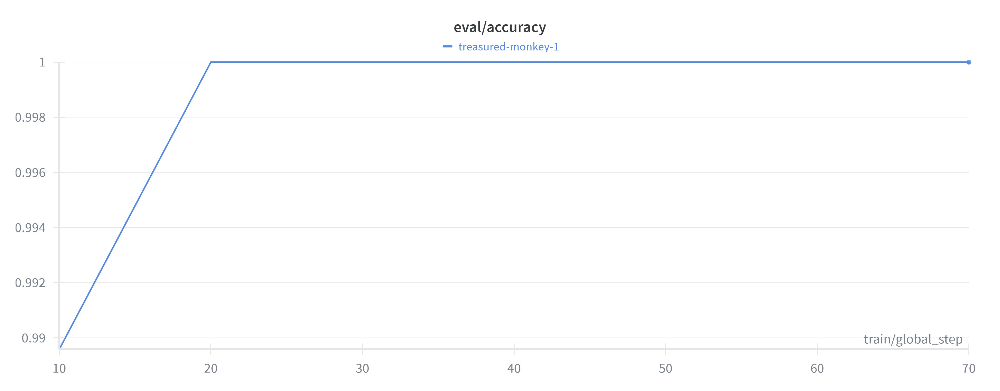
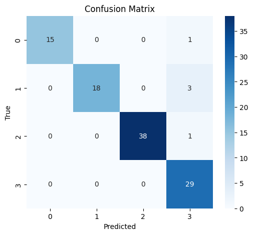
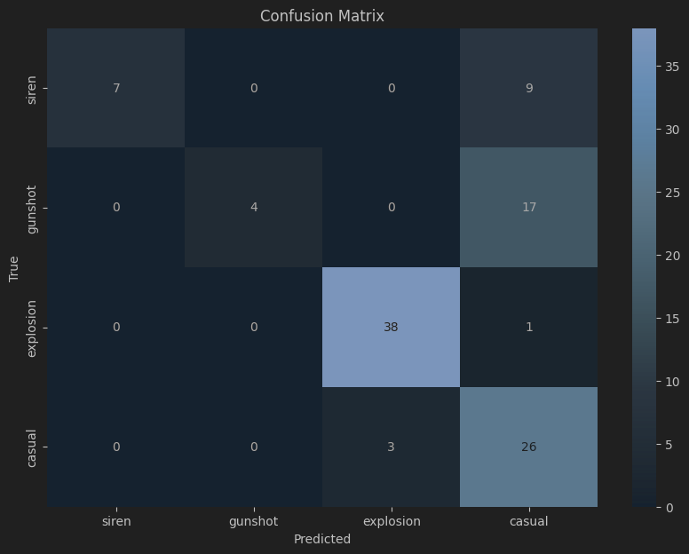
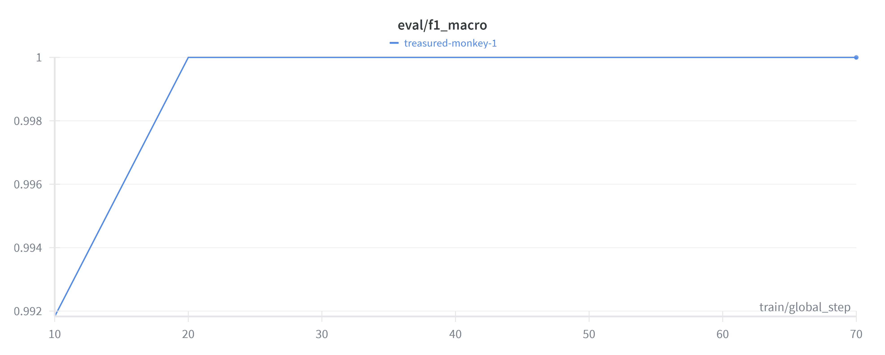
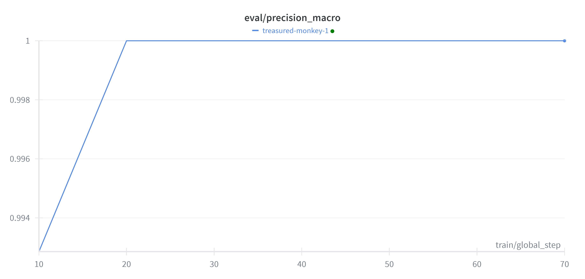
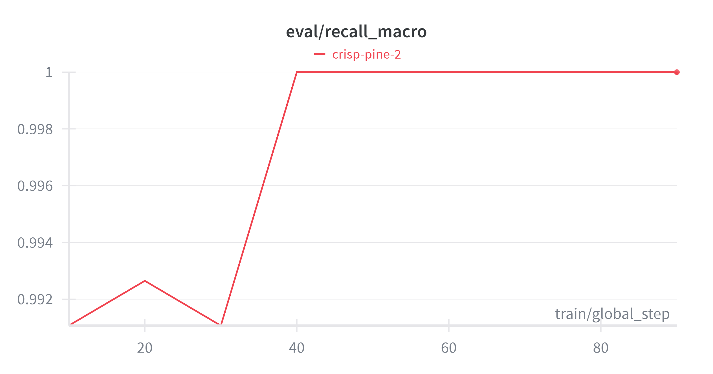
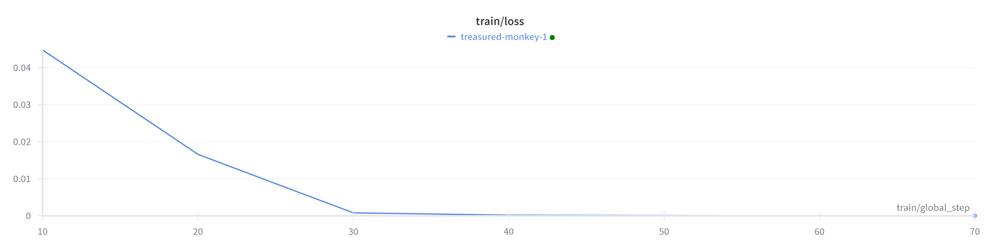
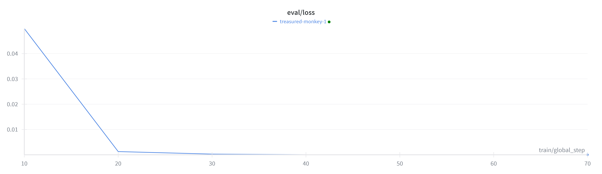
---
### HuBERT metrics
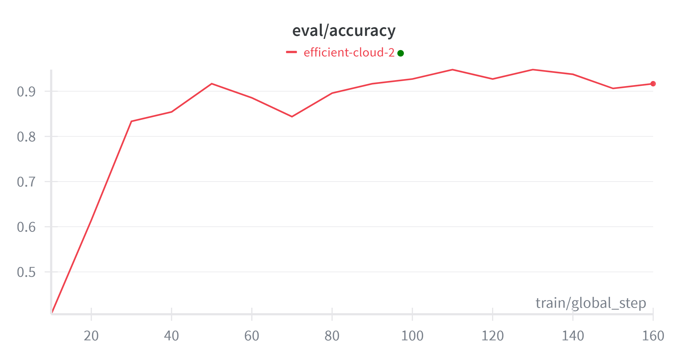
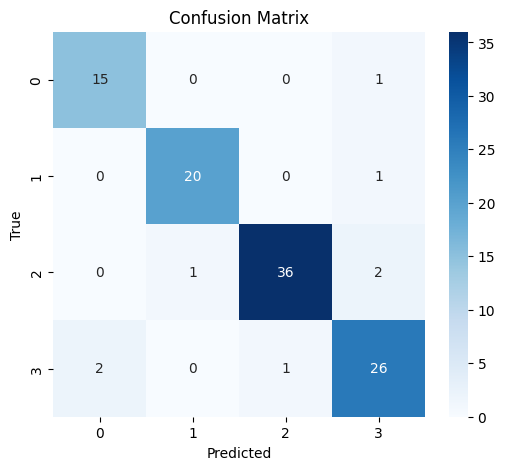
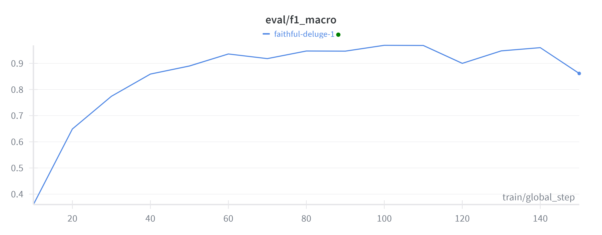
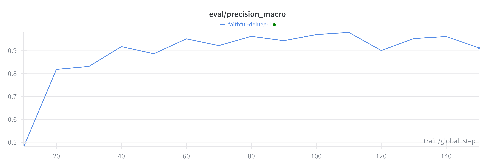
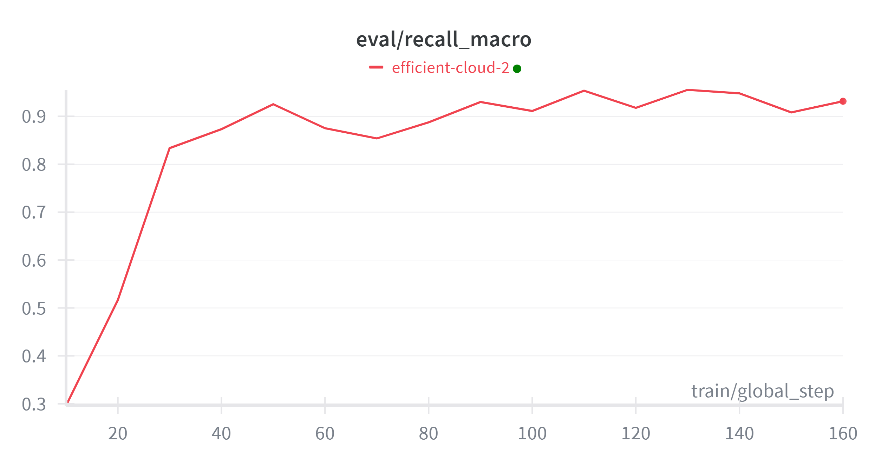
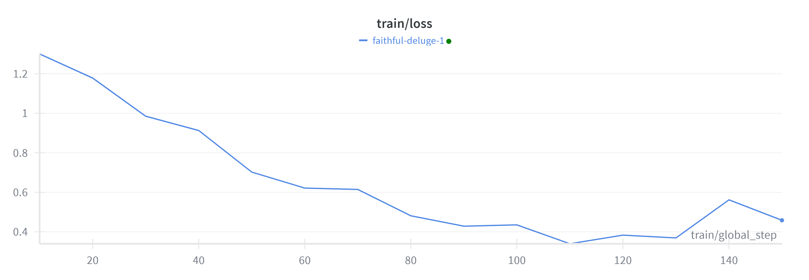
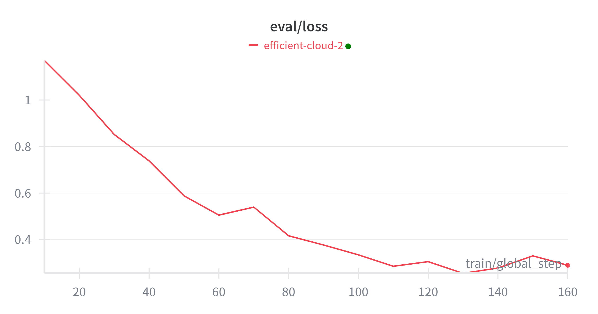